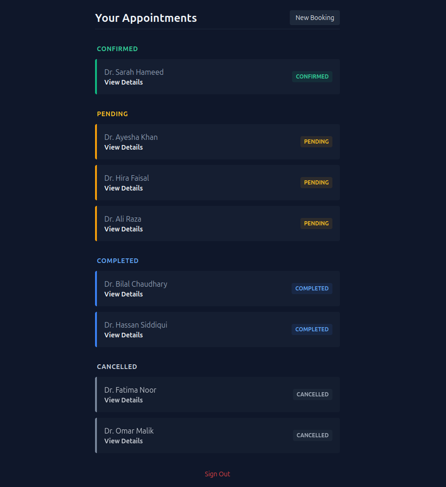
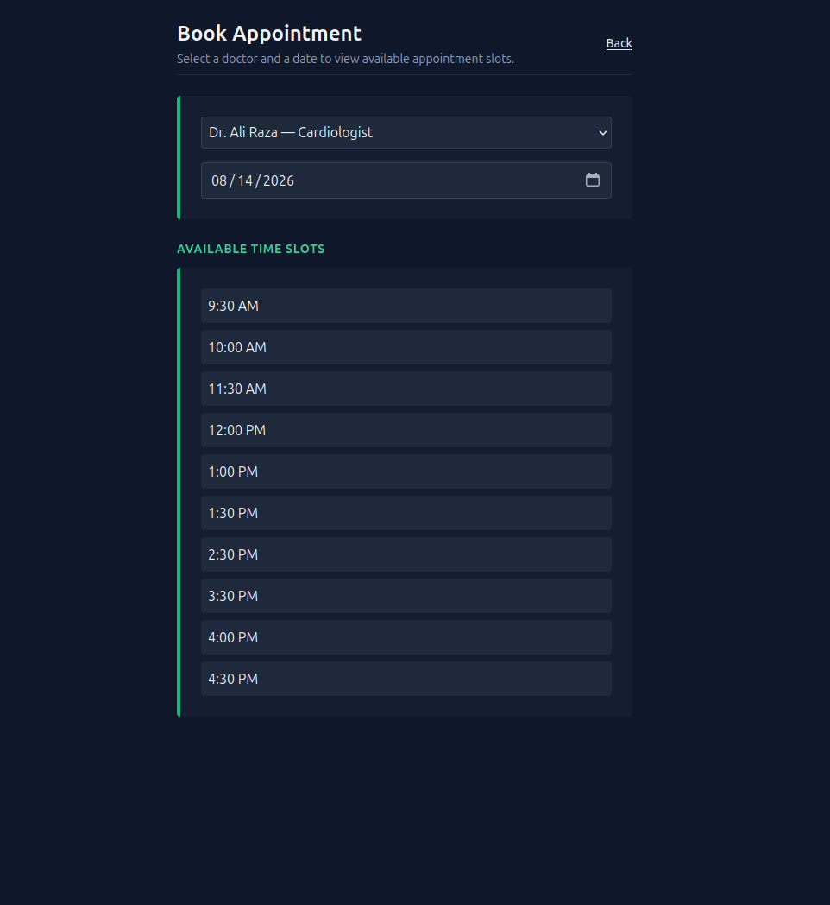
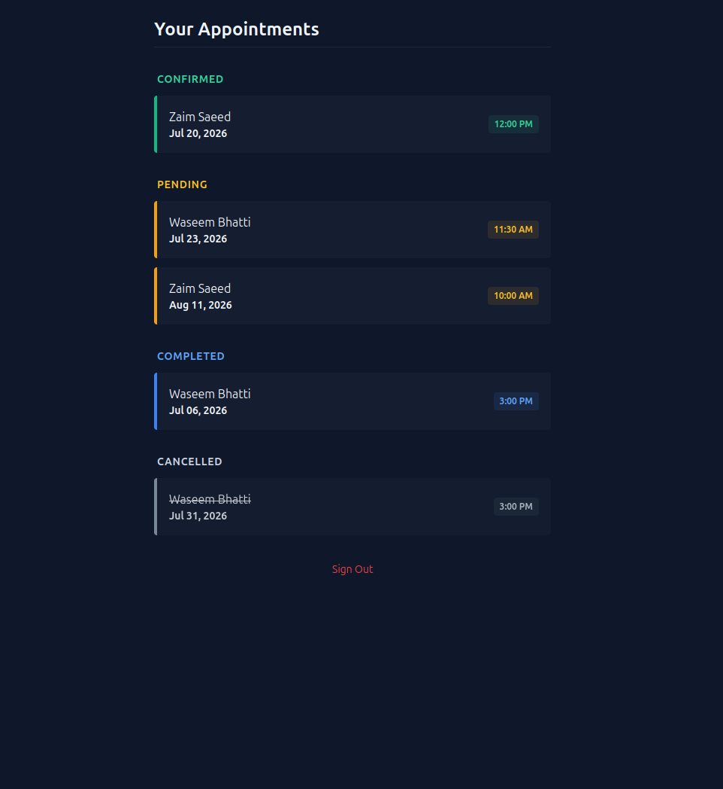
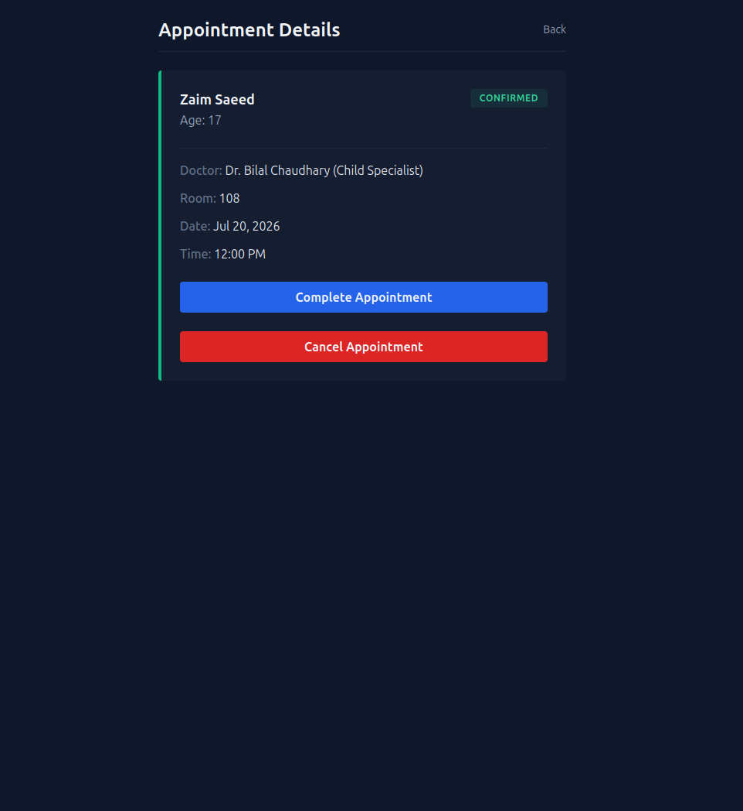

# Clinic Appointment Booking System

A Django-based appointment booking system with role-based access for doctors and patients. Built as a solo confidence-check project to test independent Django development skills.

**Live demo:** https://clinic-appointment-booking-system.up.railway.app

**Demo account (patient login — view existing appointments):**
- Username: `waseem`
- Password: `demo1234`

## Features

- **Role-based access** — separate flows and dashboards for doctors and patients
- **Slot-based appointment booking** — patients pick a doctor and date, then choose from available 30-minute slots generated dynamically based on the doctor's working hours and existing bookings
- **Double-booking prevention** — enforced at the database level via a `unique_together` constraint on doctor + appointment time
- **Past-date protection** — patients cannot book appointments in the past; same-day slots that have already passed are automatically excluded
- **Doctor dashboard** — view and manage appointments by status (Pending, Confirmed, Completed, Cancelled)
- **Admin-managed doctors** — doctors are added by an admin/superuser only; patients self-register after signup
- **REST API (DRF)** — added so patients and doctors can view their own appointments through it

## Tech Stack

- **Backend:** Python, Django
- **Database:** PostgreSQL (Neon) in production, SQLite locally
- **Styling:** Tailwind CSS (via CDN) — full disclosure: the styling on this project was vibe-coded. The focus of this project was backend logic, not frontend polish.
- **Deployment:** Railway

## Local Setup

```bash
git clone https://github.com/Hussaan-dev/clinic-appointment-booking-system.git
cd clinic-appointment-booking-system
python -m venv venv
source venv/bin/activate
pip install -r requirements.txt
python manage.py migrate
python manage.py createsuperuser
python manage.py runserver
```

Visit `http://127.0.0.1:8000` and log in via `/admin/` to add a doctor before testing the booking flow.

## Project Structure

- `clinic/models.py` — Doctor, Patient, and Appointment models
- `clinic/views.py` — booking flow, slot availability logic, role-based routing
- `clinic/forms.py` — appointment form with validation (past dates, business hours, slot boundaries)
- `core/settings.py` — environment-based configuration for local dev and production

## What I Learned

This project pushed me to work through a real timezone bug (`USE_TZ = True` causing naive vs. aware datetime comparison failures), design a slot-availability system from scratch, and think through form validation as the actual security boundary rather than relying on frontend restrictions alone.

## What's Left / Future Improvements

- Configurable doctor working hours (currently hardcoded 9 AM–5 PM)
- Email notifications for booking confirmations
- API doesn't let you create bookings yet — only the website flow has the real validation (no past dates, valid time slots, etc.) built in

## Screenshots

| Patient Dashboard | Book Appointment |
|-------------------|------------------|
|  |  |

| Doctor Dashboard | Appointment Details (Doc POV)|
|------------------|---------------------|
|  |  |